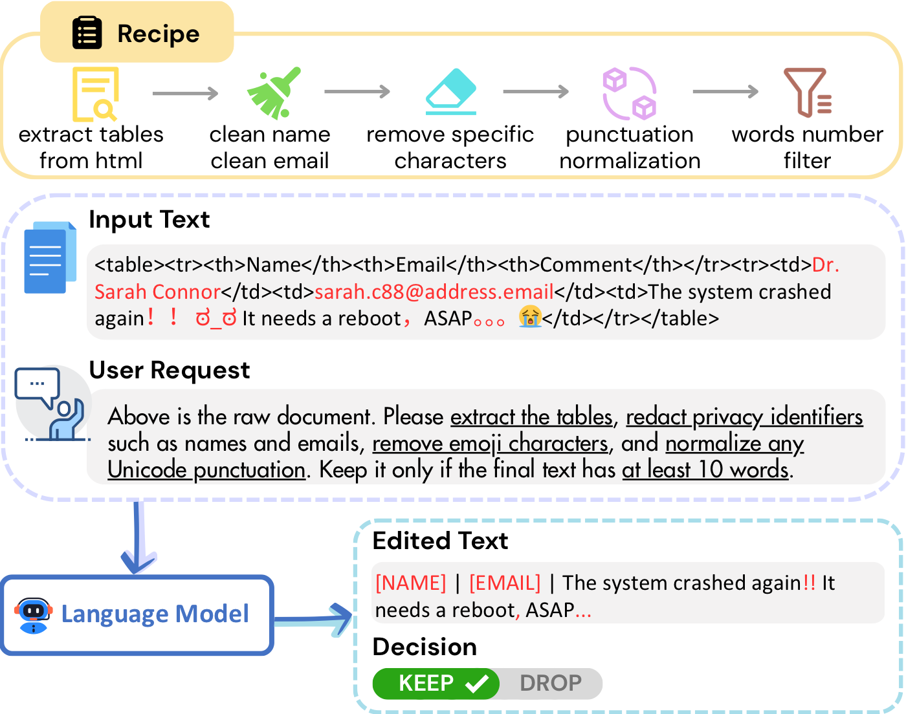
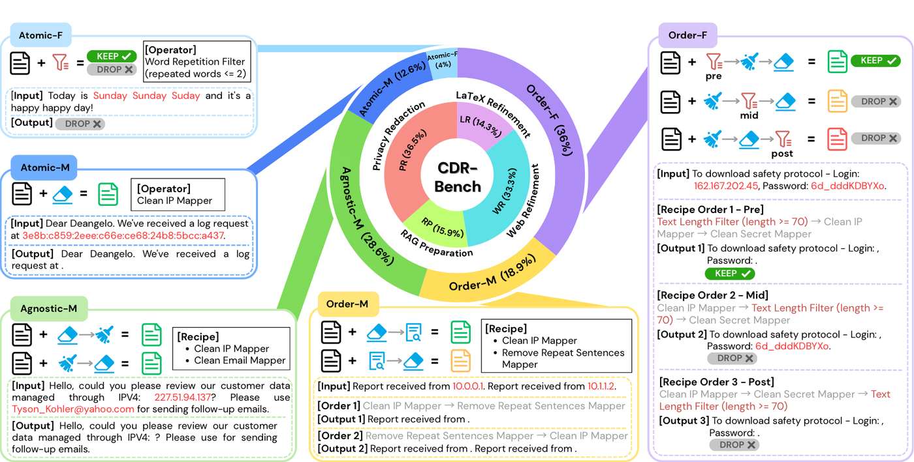
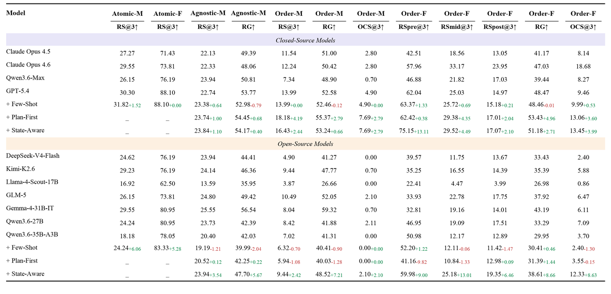
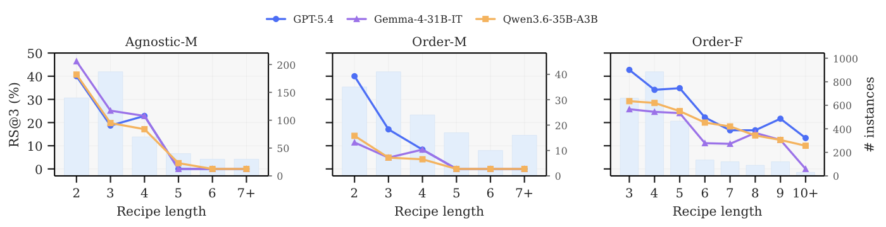
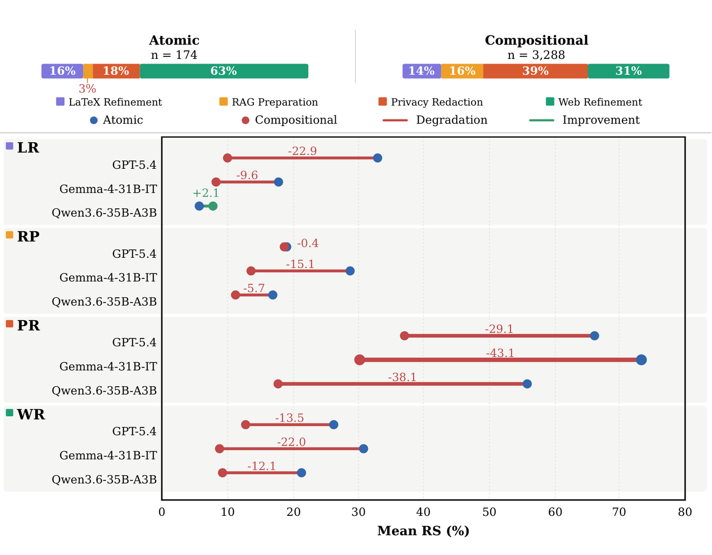
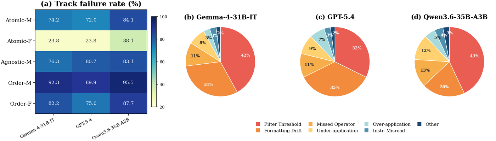
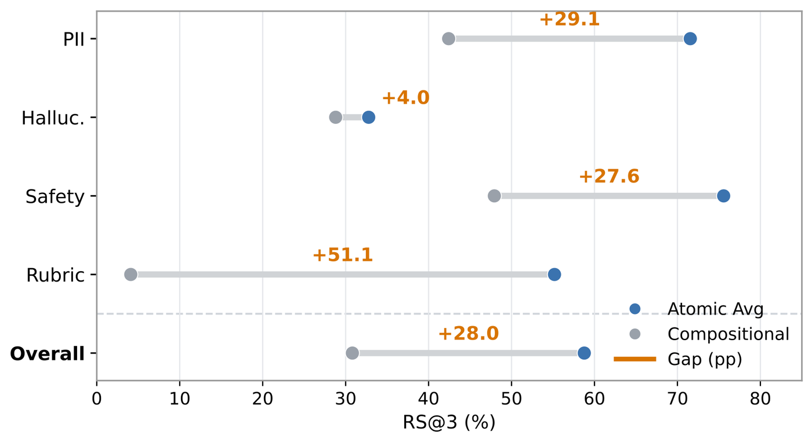

<div align="center">

# CDR-Bench: Evaluating Faithful Execution of Compositional, Order-Sensitive Data Refinement Recipes

<b>
Yuchen Huang<sup>1,3</sup>* &nbsp;
Xiang Li<sup>2,3</sup>* &nbsp;
Zhenqing Ling<sup>3</sup> &nbsp;
Sijia Li<sup>1</sup> &nbsp;
Qianli Shen<sup>3</sup> <br>
Daoyuan Chen<sup>3</sup>&dagger; &nbsp;
Yi R. (May) Fung<sup>1</sup>&dagger; &nbsp;
Yaliang Li<sup>3</sup>
</b>

<br>

<sup>1</sup>HKUST &nbsp; <sup>2</sup>NUS &nbsp; <sup>3</sup>Tongyi Lab, Alibaba Group

[](https://github.com/lukahhcm/CDR-Bench)
[](https://huggingface.co/datasets/lukahh/CDR-Bench)
[](https://arxiv.org/)

</div>

## Introduction

Data refinement transforms noisy, heterogeneous raw text into clean,
task-ready data for modern LLM pipelines, including pre-training corpus
construction, RAG preparation, privacy-sensitive processing, and quality
filtering. Although LLMs make it possible to specify refinement goals in
natural language, real data refinement rarely consists of a single isolated
edit. It often requires a compositional, order-sensitive pipeline in which each
operation changes the intermediate text state seen by later operations.

CDR-Bench evaluates whether LLMs can directly execute these refinement recipes.
A model receives a raw document and a natural-language recipe, then must return
both the refined text and the final `KEEP` / `DROP` decision. Correctness is
therefore procedural: the model must apply the right operators to the right
intermediate states in the right order, rather than merely produce a plausible
surface-level rewrite.

The benchmark contains **3,462 tasks** across Web Refinement, LaTeX Refinement,
RAG Preparation, and Privacy Redaction, covering **29 operators** and **63
unique recipe templates**. All references are deterministic, enabling exact
evaluation with Recipe Success (RS), Order-Consistent Success (OCS), and
Refinement Gain (RG), without relying on LLM-as-a-judge scoring.

<p align="center">
  
</p>

## Highlights

- **Compositional data refinement.** Recipes combine mappers and filters such as
  HTML cleaning, Unicode repair, privacy redaction, repetition removal, and
  length or quality filtering.
- **Order-sensitive evaluation.** Tracks test whether models notice that
  reordering the same operators can change the intermediate state, final text,
  and `KEEP` / `DROP` outcome.
- **Deterministic references.** Every instance has a replayed reference output,
  so scoring uses exact recipe execution metrics instead of LLM judging.
- **Multiple real-world domains.** Core tracks cover Web Refinement, LaTeX
  Refinement, RAG Preparation, and Privacy Redaction.
- **Semantic extensions.** The public release also includes PII redaction,
  hallucination processing, rubric scoring, and safety tagging with the same
  unified scoring interface.

<p align="center">
  
</p>

The percentages in the overview figure are computed over unique recipe
templates rather than task instances.

## Benchmark Tracks

| Track | Purpose | Output |
| --- | --- | --- |
| `atomic_m` | Single mapper execution | Edited text |
| `atomic_f` | Single filter execution | `KEEP` / `DROP` |
| `agnostic_m` | Multi-mapper recipes without order perturbation | Edited text |
| `order_m` | Mapper permutations where order changes the reference | Edited text |
| `order_f` | Filter placement at pre/mid/post positions | Decision + edited text |
| `semantic_pii_*` | Real-scenario PII redaction extension | Tagged text |
| `semantic_hallu_*` | Real-scenario hallucination extension | JSON or tagged text |
| `semantic_rubric_*` | HelpSteer2 rubric scoring extension | JSON |
| `semantic_safety_*` | Aegis safety tagging extension | JSON |

The core benchmark contains **3,462 tasks**, **29 operators**, and **63 unique
recipes**. The release utilities package the core rule-based tracks together
with semantic extension tracks under one schema.

## Quick Start

Links:

- Code: [https://github.com/lukahhcm/CDR-Bench](https://github.com/lukahhcm/CDR-Bench)
- Dataset: [https://huggingface.co/datasets/lukahh/CDR-Bench](https://huggingface.co/datasets/lukahh/CDR-Bench)
- Paper: [arXiv link coming soon](https://arxiv.org/)

The Hugging Face dataset exposes two configs, each with a `test` split:

```python
from datasets import load_dataset

main = load_dataset("lukahh/CDR-Bench", "main", split="test")
semantic = load_dataset("lukahh/CDR-Bench", "semantic_extension", split="test")
```

The release scripts below use the per-track files under `tracks/*.jsonl`.
For the five main paper tracks, these default files already materialize the
paper setting: three prompt variants selected with seed 0. This avoids
accidental changes in RS@3 caused by re-sampling the prompt pool. The full
prompt pools are also provided under `tracks_all_prompts/*.jsonl` for custom
prompt-seed sweeps.

The Hugging Face viewer uses `data/main/test.jsonl` and
`data/semantic_extension/test.jsonl`.

### 1. Install

Create the lightweight CDR-Bench client environment for dataset loading,
OpenAI-compatible API inference, scoring, and result summarization:

```bash
uv venv .venv --python 3.10
source .venv/bin/activate
uv pip install -r requirements.txt
```

If you prefer Conda:

```bash
conda create -n cdrbench python=3.10 -y
conda activate cdrbench
python -m pip install --upgrade pip
python -m pip install -r requirements.txt
```

`requirements.txt` intentionally does not install vLLM. For local model
serving, create a separate CUDA/Linux serving environment and install vLLM
following the official vLLM documentation for your hardware and PyTorch/CUDA
stack. CDR-Bench only needs the resulting OpenAI-compatible endpoint.

### 2. Download The Benchmark

Download the public benchmark files from Hugging Face:

```bash
bash ./scripts/download_benchmark.sh
```

Validate the downloaded JSONL files:

```bash
bash ./scripts/validate_benchmark.sh
```

### 3. Evaluate Your Model

The main command is in `scripts/eval`. Use the `api` wrapper for a hosted
OpenAI-compatible endpoint, or the `vllm` wrapper for a local vLLM server. Both
wrappers run the paper-aligned main tracks by default and write predictions and
scores under `data/evaluation/<track>/<model_slug>/`.

Hosted API or remote OpenAI-compatible endpoint:

```bash
MODEL=my-model-name \
MODEL_SLUG=my_model \
BASE_URL=https://api.example.com/v1 \
API_KEY=<your_key> \
bash ./scripts/eval/api/eval_model.sh
```

Local vLLM OpenAI server:

```bash
MODEL=my-model-name \
MODEL_SLUG=my_model \
BASE_URL=http://127.0.0.1:8000/v1 \
API_KEY=EMPTY \
bash ./scripts/eval/vllm/eval_model.sh
```

To run the semantic-extension suite instead of the main paper tracks:

```bash
EVAL_SUITE=semantic \
MODEL=my-model-name \
MODEL_SLUG=my_model \
BASE_URL=http://127.0.0.1:8000/v1 \
API_KEY=EMPTY \
bash ./scripts/eval/vllm/eval_model.sh
```

The wrappers accept `infer`, `score`, or `all`:

```bash
bash ./scripts/eval/vllm/eval_model.sh infer
bash ./scripts/eval/vllm/eval_model.sh score
```

### 4. Compare Results

Each evaluation writes per-track files such as:

```text
data/evaluation/atomic_m/my_model/
  predictions_direct_k3_seed0.jsonl
  score_direct_k3_seed0/
    summary.json
    paper_metrics.json
    instance_metrics.csv
```

Use `paper_metrics.json` for the main-table metrics (`RS@3`, `RG`, `OCS@3`,
and order-f slot scores). To regenerate scores for an existing prediction
directory:

```bash
bash ./scripts/score/score_suite.sh \
  --track-family main \
  --predictions-root data/evaluation \
  --model-dirname my_model \
  --write-csv
```

To compare your model against one or more baselines:

```bash
bash ./scripts/summarize_results.sh \
  --track-family main \
  --models BASE_MODEL,my_model \
  --base-model BASE_MODEL \
  --output-dir data/evaluation/reports/my_model_comparison
```

This writes `model_waterline.csv`, `summary.md`, and machine-readable JSON/CSV
reports that can be compared against the paper table below.

The CDR-Bench client environment covers:

- loading the dataset with `datasets.load_dataset`;
- downloading and validating benchmark JSONL files;
- running remote OpenAI-compatible API inference;
- scoring predictions;
- optionally talking to a local vLLM server through its OpenAI-compatible HTTP
  endpoint.

For vLLM serving, install vLLM separately on a Linux CUDA machine. If your
cluster requires a specific PyTorch/CUDA wheel, install that first following
your cluster policy, then install vLLM in that serving environment. The release
keeps helper scripts under `scripts/model_serve/start_vllm_*.sh` and
`scripts/stop_vllm.sh`; run those scripts after activating your vLLM serving
environment. You can also start vLLM manually and point CDR-Bench to it with
`BASE_URL`.

Run a small inference smoke test:

```bash
bash ./scripts/run_inference.sh \
  --benchmark-path data/benchmark_v3/tracks/atomic_m.jsonl \
  --output-path data/results/atomic_m/MODEL/predictions.jsonl \
  --model MODEL_NAME \
  --backend api \
  --prompt-variant-indices 0 \
  --max-samples 10
```

For paper-style evaluation, use the `scripts/eval` wrappers. They mirror the
experiment driver used for the reported results: API and vLLM wrappers only set
backend-specific defaults, while both call the same shared runner.

By default, inference is deterministic: the wrappers pass `TEMPERATURE=0`,
disable thinking mode where the backend exposes a compatible control, and for
local vLLM add `do_sample=false`. For GPT-style reasoning APIs, the runner uses
the lowest reasoning effort setting it can request. Override these only when
running an explicit ablation.

There are two evaluation suites:

- `main`: the five paper tracks, `atomic_m`, `atomic_f`, `agnostic_m`,
  `order_m`, and `order_f`. This is the setting for reproducing the main paper
  numbers. The default `tracks/*.jsonl` files already contain the paper-aligned
  seed-0 three-prompt subset, writing `predictions_direct_k3_seed0.jsonl` and
  `score_direct_k3_seed0/`.
- `semantic`: appendix-style real-scenario extensions adapted from external
  benchmarks. Current implemented domains are PII redaction, hallucination
  processing, HelpSteer2 rubric scoring, and Aegis safety tagging, each with
  atomic and compositional tracks. These are reported as atomic-vs-compositional
  comparisons, not merged into the main paper tracks. The default prompt styles
  are `direct`, `imperative_checklist`, and `application_context`.

The `scripts/eval` wrappers default to the release-local `data/evaluation`
directory. Lower-level smoke-test scripts may still write to `data/results`
when called directly.

The default prompt mode is `direct`, which is the mode used for the main paper
tables. For prompt-mode ablations on the main tracks, set `PROMPT_MODE` or pass
`--prompt-mode` with one of `direct`, `few_shot`, `plan_first`, or
`state_aware`; outputs are named accordingly, for example
`predictions_plan_first_k3_seed0.jsonl` and `score_plan_first_k3_seed0/`.

Remote API example:

```bash
OPENAI_API_KEY=<your_key> bash ./scripts/eval/api/eval_gpt_5_4.sh
```

Local vLLM example:

```bash
bash ./scripts/eval/vllm/eval_gemma4.sh
```

Run the semantic suite with the same backend controls:

```bash
EVAL_SUITE=semantic OPENAI_API_KEY=<your_key> bash ./scripts/eval/api/eval_gpt_5_4.sh
EVAL_SUITE=semantic bash ./scripts/eval/vllm/eval_gemma4.sh
```

The wrappers also accept `infer`, `score`, or `all`:

```bash
bash ./scripts/eval/api/eval_gpt_5_4.sh infer
bash ./scripts/eval/api/eval_gpt_5_4.sh score
```

Score predictions:

```bash
bash ./scripts/score_predictions.sh \
  --predictions-path data/results/atomic_m/MODEL/predictions.jsonl \
  --output-dir data/results/atomic_m/MODEL/score \
  --rs-at-k 3 \
  --write-csv
```

Scoring writes both generic reports and paper-facing metrics. Use
`summary.json` for overall RS/RG summaries and `paper_metrics.json` for the
main-table fields. On the order-sensitive tracks, `paper_metrics.json` includes
`ocs_at_k`; for `order_f`, it also includes `rs_pre@k`, `rs_mid@k`, and
`rs_post@k`.

Summarize one or more scored models into leaderboard-style reports:

```bash
bash ./scripts/summarize_results.sh \
  --track-family all \
  --models BASE_MODEL,MY_MODEL \
  --base-model BASE_MODEL \
  --output-dir data/evaluation/reports/my_model_comparison
```

This writes `model_waterline.csv`, `summary.md`, and machine-readable JSON/CSV
files that show each model's aggregate score, rank, gap to the best available
model, and delta against an optional base model.

All paths above are relative to this release folder. The user-facing download,
inference, and scoring scripts do not depend on files outside this folder.

## Inference Backends

CDR-Bench uses an OpenAI-compatible chat-completions interface. Choose one of
two backends:

| Backend | Use case | Required options |
| --- | --- | --- |
| `api` | Remote API or hosted OpenAI-compatible service | `--model`; optionally `--base-url`, `--api-key` |
| `vllm` | Local vLLM OpenAI server | `--model --backend vllm`; optionally `--base-url` |

For API models, set `OPENAI_API_KEY`, `DASHSCOPE_API_KEY`, or pass `--api-key`.
Several common model aliases such as `gpt-5.4`, `glm-5`, `deepseek_v4_flash`,
and `kimi-k2.6` resolve to the paper-style API names and endpoints.

For local vLLM, start a server separately in your vLLM serving environment.
Install vLLM from the official documentation for your machine, then expose an
OpenAI-compatible endpoint, for example:

```bash
vllm serve /path/to/model \
  --served-model-name local-model \
  --port 8000 \
  --trust-remote-code
```

If your installed vLLM version uses the older entrypoint, the equivalent command
is `python -m vllm.entrypoints.openai.api_server ...`. The release also keeps
the same helper scripts as the experiment workspace; run them in the vLLM
serving environment, not necessarily in the lightweight CDR-Bench client
environment:

```bash
bash ./scripts/model_serve/start_vllm_gemma4.sh
bash ./scripts/model_serve/start_vllm_qwen3_6_27b.sh
bash ./scripts/stop_vllm.sh 8001
```

Model paths, ports, GPU IDs, tensor parallel size, and max lengths can be
overridden with environment variables such as `MODEL_PATH`, `PORT`, `GPU_IDS`,
`TP_SIZE`, `MAX_MODEL_LEN`, and `MAX_NUM_BATCHED_TOKENS`.

Then run:

```bash
bash ./scripts/run_inference.sh \
  --benchmark-path data/benchmark_v3/tracks/atomic_m.jsonl \
  --output-path data/results/atomic_m/local-model/predictions.jsonl \
  --model local-model \
  --backend vllm \
  --base-url http://127.0.0.1:8000/v1 \
  --api-key EMPTY
```

## Suite-Level Evaluation

Run all main paper tracks:

```bash
bash ./scripts/run_inference_suite.sh \
  --track-family core_rule \
  --model MODEL_NAME \
  --model-dirname MODEL \
  --backend api
```

By default, this reads `data/benchmark_v3/tracks/*.jsonl`. For the five main
tracks, those files already contain the paper-aligned seed-0 three-prompt
subset, so no prompt-pool sampling choice is needed.

To run a custom prompt-seed sweep from the full prompt pool, explicitly switch
to `tracks_all_prompts`:

```bash
BENCHMARK_TRACKS_SUBDIR=tracks_all_prompts \
PROMPT_VARIANT_SAMPLE_SIZE=3 \
PROMPT_VARIANT_SAMPLING_SEED=1 \
bash ./scripts/eval/vllm/eval_qwen3_6_35b_a3b.sh
```

Score the same suite:

```bash
bash ./scripts/score_suite.sh \
  --track-family core_rule \
  --model-dirname MODEL \
  --rs-at-k 3 \
  --write-csv
```

Use `--track-family semantic_extension` for all semantic extension tracks, or
set `EVAL_SUITE=semantic` on an API/vLLM wrapper. Additional semantic domains
can be added later by placing paired atomic/compositional track files under
`data/benchmark_v3/tracks/` and appending their names through
`SEMANTIC_EXTRA_TRACKS`.

Generate a report after scoring:

```bash
bash ./scripts/summarize_results.sh \
  --track-family semantic_extension \
  --models BASE_MODEL,MY_MODEL,BEST_MODEL \
  --base-model BASE_MODEL
```

The semantic-extension gap is always reported as:

```text
Gap = Atomic Avg RS@3 - Compositional RS@3
```

`Atomic Avg RS@3` is a macro-average over the atomic subtasks inside a semantic
domain, while `Compositional RS@3` is the score on the paired compositional
track. The report therefore makes two things visible at once: how well a model
handles individual semantic operations, and how much performance drops when the
same operations must be composed.

## Data Layout

This release folder is the project root. Data, predictions, and scores should
stay inside it:

```text
data/benchmark_v3/
  manifest.json
  benchmark_v3_all.jsonl
  benchmark_v3_all_prompts.jsonl
  tracks/
    # default evaluation files; main tracks are materialized to paper seed=0, K=3
    atomic_m.jsonl
    atomic_f.jsonl
    agnostic_m.jsonl
    order_m.jsonl
    order_f.jsonl
    semantic_pii_atomic.jsonl
    semantic_pii_compositional.jsonl
    semantic_hallu_atomic.jsonl
    semantic_hallu_compositional.jsonl
    semantic_rubric_atomic.jsonl
    semantic_rubric_compositional.jsonl
    semantic_safety_atomic.jsonl
    semantic_safety_compositional.jsonl
  tracks_all_prompts/
    # full prompt-pool copies for custom prompt sampling
    atomic_m.jsonl
    atomic_f.jsonl
    agnostic_m.jsonl
    order_m.jsonl
    order_f.jsonl

data/evaluation/
  atomic_m/
    MODEL/
      predictions_direct_k3_seed0.jsonl
      score_direct_k3_seed0/
        summary.json
        paper_metrics.json
        instance_metrics.jsonl
        scored_variant_predictions.jsonl
  order_f/
    MODEL/
      ...
  reports/
    model_waterline.csv
    core_model_summary.csv
    semantic_model_summary.csv
    core_summary.csv
    semantic_summary.csv
    summary.json
    summary.md
```

The compact public files under `tracks/` are intended for benchmark users.
They are the recommended default for reproducing paper-level RS@3 numbers.
To run a custom prompt-seed sweep on the full main-track prompt pools, set
`BENCHMARK_TRACKS_SUBDIR=tracks_all_prompts` and choose
`PROMPT_VARIANT_SAMPLING_SEED`.
The public release does not include internal data-construction scripts.

## Schema

Each row contains the input, reference output, operator metadata, prompt
variants, and scoring contract. Important fields include:

| Field | Meaning |
| --- | --- |
| `benchmark_track` | Report-level track such as `order_f` or `semantic_pii` |
| `benchmark_split` | `single`, `atomic`, or `compositional` |
| `track_family` | `core_rule` or `semantic_extension` |
| `operator_sequence` | Ordered recipe operators |
| `reference_status` | Gold `KEEP` / `DROP` decision |
| `reference_text` | Deterministic reference text or JSON reference |
| `output_format` | `tagged_text`, `json`, or `json_and_tagged_text` |
| `scoring_profile` | `text_refinement`, `structured_json`, or mixed profile |
| `reports_refinement_gain` | Whether RG is meaningful for this row |
| `prompt_variants` | Natural-language recipe variants for RS@K evaluation |
| `recipe_prompt_key` | Stable key used for paper-aligned prompt sampling |
| `selected_prompt_variant_indices` | Original prompt-pool indices materialized in the default `tracks/` files |
| `prompt_candidate_pool_count` | Size of the full prompt pool before materialization |

Example JSONL row from an `atomic_m`-style text-refinement task:

```json
{
  "instance_id": "891914c6b7a20b54",
  "benchmark_track": "atomic_m",
  "benchmark_split": "single",
  "track_family": "core_rule",
  "source_track": "atomic_m",
  "base_sample_id": "enwiki-enwiki-latest-pages-articles1_p1p41242-16054",
  "domain": "web",
  "source_record_id": "enwiki-enwiki-latest-pages-articles1_p1p41242-16054",
  "source_benchmark": "cdrbench_rule_based",
  "input_text": "#REDIRECT [[Technology in Star Trek]]\n\n{{Redirect category shell|\n{{R from subpage}}\n}}",
  "input_length_chars": 87,
  "input_length_bucket": "short",
  "operator": "clean_copyright_mapper",
  "operator_kind": "mapper",
  "operator_sequence": ["clean_copyright_mapper"],
  "semantic_operator": null,
  "recipe_id": null,
  "recipe_type": null,
  "recipe_length": 1,
  "order_family_id": null,
  "order_slot": null,
  "order_group_instance_id": null,
  "group_success_rule": null,
  "reference_status": "KEEP",
  "reference_text": "{{Redirect category shell|\n{{R from subpage}}\n}}",
  "reference_text_full_run": null,
  "output_format": "tagged_text",
  "scoring_profile": "text_refinement",
  "reports_refinement_gain": true,
  "prompt_variants": [
    {
      "style_id": "analyst_handoff",
      "style_label": "Analyst Handoff",
      "user_requirement": "clean the front of each file so we are not carrying copyright headers into the next stage: if it starts with a multiline comment containing the word \"copyright,\" remove that whole comment; otherwise strip the opening block of blank lines and lines starting with //, #, or --."
    },
    {
      "style_id": "application_context",
      "style_label": "Application-Context Task",
      "user_requirement": "for downstream indexing, clean each text so the indexed content does not start with copyright headers. Remove an opening block comment when that block contains the word \"copyright\"; if not present, remove the initial consecutive blank lines and comment lines beginning with //, #, or --."
    },
    {
      "style_id": "imperative_checklist",
      "style_label": "Imperative Checklist",
      "user_requirement": "remove any copyright notice or license-style ownership boilerplate from the beginning of the text, including a leading block comment if it contains the word \"copyright\"; if there is no such block, strip off the opening run of comment-style lines at the top that start with //, #, or --, along with any blank lines mixed into that opening header."
    },
    {
      "style_id": "concise_brief",
      "style_label": "Concise Brief",
      "user_requirement": "Clean the beginning of the text by dropping a starting multiline copyright comment; if none applies, remove leading blank lines and top comment lines prefixed with //, #, or --."
    },
    {
      "style_id": "conversational_cooperative",
      "style_label": "Conversational Cooperative",
      "user_requirement": "clean up the beginning so it doesn't keep any copyright header stuff. If the text starts with a multiline comment containing the word \"copyright,\" remove that whole comment; otherwise strip the opening blank lines and any top lines that start with //, #, or --."
    },
    {
      "style_id": "end_weighted_instruction",
      "style_label": "End-Weighted Instruction",
      "user_requirement": "remove any copyright header from the beginning by deleting a leading multiline comment if it contains the word \"copyright\"; if not, strip the opening consecutive blank lines and lines starting with //, #, or -- before the actual content."
    },
    {
      "style_id": "goal_oriented",
      "style_label": "Goal-Oriented Description",
      "user_requirement": "end up with text that starts at the real content rather than a copyright header: if the opening multiline comment contains the word \"copyright,\" remove that entire comment, and otherwise trim away the initial stretch of blank lines and comment-style header lines beginning with //, #, or --."
    },
    {
      "style_id": "negative_constraint_driven",
      "style_label": "Negative-Constraint Driven",
      "user_requirement": "make sure the final text does not begin with copyright notices, license-style ownership boilerplate, or opening comment-header lines. To do that, remove a leading multiline comment if it contains the word \"copyright\"; otherwise remove the initial consecutive blank lines and lines starting with //, #, or --."
    },
    {
      "style_id": "policy_like",
      "style_label": "Policy-Like Requirement",
      "user_requirement": "before use, each sample must start with substantive content rather than a copyright header. Remove any leading multiline comment that includes the word \"copyright\"; if that condition is not met, remove the consecutive opening blank lines and lines whose first characters are //, #, or --."
    },
    {
      "style_id": "qa_request",
      "style_label": "Quality-Control Request",
      "user_requirement": "clean away any copyright header at the beginning of the sample. If the text opens with a multiline comment containing the word \"copyright,\" remove that whole comment; otherwise remove the opening sequence of blank lines and comment-style lines starting with //, #, or --. Keep the cleaned version only as the quality-checked output."
    },
    {
      "style_id": "recipe_narrative",
      "style_label": "Recipe Narrative",
      "user_requirement": "I have texts that often begin with copyright notices and comment-style file headers. Please remove a leading multiline comment when it contains the word \"copyright\"; if there is no such comment, strip off the opening stretch of blank lines and lines starting with //, #, or -- so the text begins at the real content."
    }
  ],
  "prompt_variant_count": 11,
  "difficulty_score": 1,
  "difficulty_label": "easy",
  "pii_meta": null,
  "hallu_meta": null
}
```

## Metrics

**Recipe Success (RS).** Exact recipe execution. A prediction succeeds only when
the status matches and the normalized output matches the deterministic
reference. For JSON rows, RS uses canonical JSON exact match.

**RS@K.** An instance is solved if any of the first `K` prompt variants succeeds.

**Refinement Gain (RG).** Edit-distance progress toward the reference. RG is
reported only for text-output rows, not for JSON-only detection, extraction, or
classification subtasks.

**Order-Consistent Success (OCS).** Group-level success for order-sensitive
recipes. A model must solve every ordering/placement variant in the group.

## Paper Results At A Glance

CDR-Bench exposes a gap between plausible rewriting and faithful procedure
execution. In the paper experiments, models often preserve broad text quality
while failing exact recipe execution under operator composition or reordering.
Deferred filter decisions are especially brittle because the model must evaluate
the transformed intermediate state rather than the original input.

Two headline findings:

- On `order_f`, GPT-5.4 drops from **62.04 RS@3** when filtering is applied
  before transformations to **14.97 RS@3** when the same filtering decision is
  deferred to the post-transformation state, a **47.07 pp** decline.
- On `order_m`, group-level order consistency remains below **5% OCS@3** for
  every direct-prompt baseline model, even when individual recipe success is
  higher.

Representative main-track results from the paper are shown below. All numbers
are percentages; `RS@3` is recipe success over three sampled prompt variants,
`RG` is refinement gain, and `OCS@3` is group-level order-consistent success.

<p align="center">
  
</p>

<p align="center">
  
</p>

<p align="center">
  
</p>

<p align="center">
  
</p>

## Semantic Extensions

The release includes appendix-compatible real-scenario extensions:

- **PII redaction:** 500 base samples. Compositional rows expand into 1,394
  atomic rows by present PII group.
- **Hallucination processing:** 300 FAVA-derived base samples, balanced as 150
  hallucinated and 150 clean examples to reduce binary-label shortcut bias.
  Atomic rows expand each base sample into detection, span extraction, type
  classification, and correction subtasks.
- **Rubric scoring:** 300 HelpSteer2 validation prompt-response pairs. Atomic
  rows score one dimension at a time (`helpfulness`, `correctness`,
  `coherence`, `complexity`, or `verbosity`); compositional rows score all five
  dimensions in one JSON object.
- **Safety tagging:** 300 Aegis 2.0 test prompt-response pairs, balanced across
  the observed prompt/response label pairs. Atomic rows classify one field
  (`prompt_label`, `response_label`, or `violated_categories`); compositional
  rows return all three fields in one JSON object.

<p align="center">
  
</p>

The semantic-extension figure summarizes the average atomic RS@3,
compositional RS@3, and the resulting composition gap for PII redaction,
hallucination processing, safety tagging, and rubric scoring.

## Scripts

Scripts are grouped by function. The root-level scripts are compatibility
wrappers that forward to the organized folders.

```text
scripts/data/
  download_benchmark.sh
  validate_benchmark.sh
scripts/infer/
  run_inference.sh
  run_inference_suite.sh
scripts/score/
  score_predictions.sh
  score_suite.sh
scripts/eval/
  run_model_eval.sh
  main.sh
  semantic.sh
  api/
  vllm/
scripts/model_serve/
  start_vllm_*.sh
scripts/start_vllm.sh
scripts/stop_vllm.sh
```

## Citation

If you use CDR-Bench, please cite the paper:

```bibtex


```
