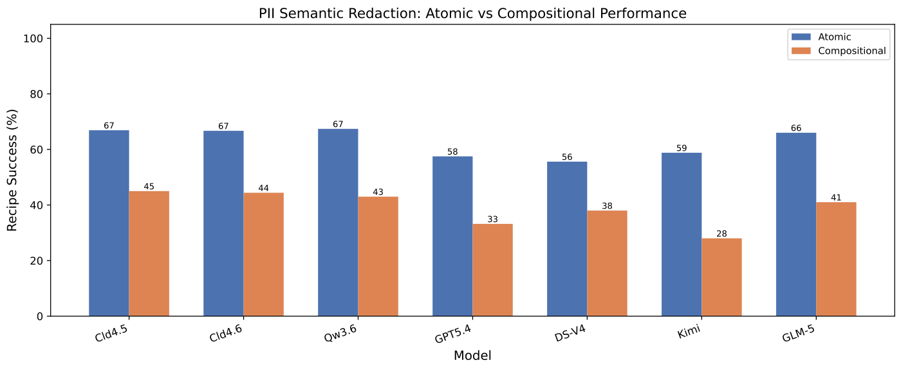
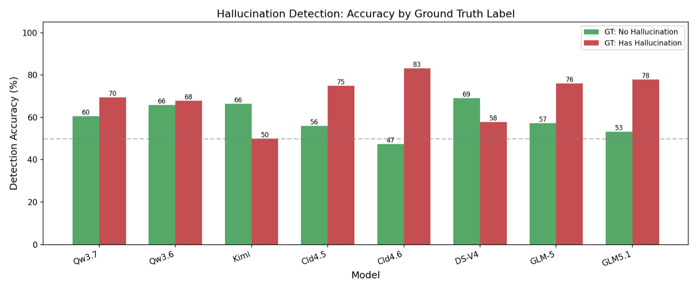

# CDR-Bench

**Can LLMs execute compositional, order-sensitive data refinement recipes?**

CDR-Bench is a benchmark for evaluating whether language models can directly
execute multi-step data refinement procedures over text. A model receives a raw
document and a natural-language recipe, then must return both the refined text
and the final `KEEP` / `DROP` decision.

Unlike general text-editing benchmarks, CDR-Bench focuses on procedural
faithfulness: the model must apply the right operators to the right intermediate
text state, in the right order. Unlike agent benchmarks, it isolates recipe
execution from code generation, tool use, sandbox failures, and LLM-as-a-judge
scoring.

<p align="center">
  
</p>

## Highlights

- **Compositional data refinement.** Recipes combine mappers and filters such as
  HTML cleaning, Unicode repair, privacy redaction, repetition removal, and
  length or quality filtering.
- **Order-sensitive evaluation.** Tracks test whether models notice that
  reordering the same operators can change the intermediate state, final text,
  and `KEEP` / `DROP` outcome.
- **Deterministic references.** Every instance has a replayed reference output,
  so scoring uses exact recipe execution metrics instead of LLM judging.
- **Multiple real-world domains.** Core tracks cover Web Refinement, LaTeX
  Refinement, RAG Preparation, and Privacy Redaction.
- **Semantic extensions.** The public release also includes PII redaction and
  hallucination-processing scenarios with the same unified scoring interface.

<p align="center">
  
</p>

## Benchmark Tracks

| Track | Purpose | Output |
| --- | --- | --- |
| `atomic_m` | Single mapper execution | Edited text |
| `atomic_f` | Single filter execution | `KEEP` / `DROP` |
| `agnostic_m` | Multi-mapper recipes without order perturbation | Edited text |
| `order_m` | Mapper permutations where order changes the reference | Edited text |
| `order_f` | Filter placement at pre/mid/post positions | Decision + edited text |
| `semantic_pii_*` | Real-scenario PII redaction extension | Tagged text |
| `semantic_hallu_*` | Real-scenario hallucination extension | JSON or tagged text |

The core benchmark contains **3,319 tasks**, **29 operators**, and **63 unique
recipes**. The release utilities package the core rule-based tracks together
with semantic extension tracks under one schema.

## Quick Start

Install dependencies from this folder:

```bash
pip install -r requirements.txt
```

Download the public benchmark files from Hugging Face:

```bash
bash ./scripts/download_benchmark.sh
```

Validate the downloaded JSONL files:

```bash
bash ./scripts/validate_benchmark.sh
```

Run a small inference smoke test:

```bash
bash ./scripts/run_inference.sh \
  --benchmark-path data/benchmark_v3/tracks/atomic_m.jsonl \
  --output-path data/results/atomic_m/MODEL/predictions.jsonl \
  --model MODEL_NAME \
  --backend api \
  --prompt-variant-indices 0 \
  --max-samples 10
```

For paper-style evaluation, use the `scripts/eval` wrappers. They mirror the
experiment driver used for the reported results: API and vLLM wrappers only set
backend-specific defaults, while both call the same shared runner.

There are two evaluation suites:

- `main`: the five paper tracks, `atomic_m`, `atomic_f`, `agnostic_m`,
  `order_m`, and `order_f`. This is the setting for reproducing the main paper
  numbers. It uses all prompt variants as the pool and deterministically samples
  3 variants with seed 0, writing `predictions_direct_k3_seed0.jsonl` and
  `score_direct_k3_seed0/`.
- `semantic`: appendix-style real-scenario extensions adapted from external
  benchmarks. Current implemented domains are PII redaction and hallucination
  processing, each with atomic and compositional tracks. These are reported as
  atomic-vs-compositional comparisons, not merged into the main paper tracks.
  The default prompt styles are `direct`, `imperative_checklist`, and
  `application_context`.

The `scripts/eval` wrappers default to `data/evaluation_v2`, matching the
experiment workspace. Lower-level smoke-test scripts may still write to
`data/results` when called directly.

Remote API example:

```bash
OPENAI_API_KEY=<your_key> bash ./scripts/eval/api/eval_gpt_5_4.sh
```

Local vLLM example:

```bash
bash ./scripts/eval/vllm/eval_gemma4.sh
```

Run the semantic suite with the same backend controls:

```bash
EVAL_SUITE=semantic OPENAI_API_KEY=<your_key> bash ./scripts/eval/api/eval_gpt_5_4.sh
EVAL_SUITE=semantic bash ./scripts/eval/vllm/eval_gemma4.sh
```

The wrappers also accept `infer`, `score`, or `all`:

```bash
bash ./scripts/eval/api/eval_gpt_5_4.sh infer
bash ./scripts/eval/api/eval_gpt_5_4.sh score
```

Score predictions:

```bash
bash ./scripts/score_predictions.sh \
  --predictions-path data/results/atomic_m/MODEL/predictions.jsonl \
  --output-dir data/results/atomic_m/MODEL/score \
  --rs-at-k 3 \
  --write-csv
```

All paths above are relative to this release folder. The user-facing download,
inference, and scoring scripts do not depend on files outside this folder.

## Inference Backends

CDR-Bench uses an OpenAI-compatible chat-completions interface. Choose one of
two backends:

| Backend | Use case | Required options |
| --- | --- | --- |
| `api` | Remote API or hosted OpenAI-compatible service | `--model`; optionally `--base-url`, `--api-key` |
| `vllm` | Local vLLM OpenAI server | `--model --backend vllm`; optionally `--base-url` |

For API models, set `OPENAI_API_KEY`, `DASHSCOPE_API_KEY`, or pass `--api-key`.
Several common model aliases such as `gpt-5.4`, `glm-5`, `deepseek_v4_flash`,
and `kimi-k2.6` resolve to the paper-style API names and endpoints.

For local vLLM, start a server separately, for example:

```bash
python -m vllm.entrypoints.openai.api_server \
  --model /path/to/model \
  --served-model-name local-model \
  --port 8000 \
  --trust-remote-code
```

The release also keeps the same helper scripts as the experiment workspace:

```bash
bash ./scripts/model_serve/start_vllm_gemma4.sh
bash ./scripts/model_serve/start_vllm_qwen3_6_27b.sh
bash ./scripts/stop_vllm.sh 8001
```

Model paths, ports, GPU IDs, tensor parallel size, and max lengths can be
overridden with environment variables such as `MODEL_PATH`, `PORT`, `GPU_IDS`,
`TP_SIZE`, `MAX_MODEL_LEN`, and `MAX_NUM_BATCHED_TOKENS`.

Then run:

```bash
bash ./scripts/run_inference.sh \
  --benchmark-path data/benchmark_v3/tracks/atomic_m.jsonl \
  --output-path data/results/atomic_m/local-model/predictions.jsonl \
  --model local-model \
  --backend vllm \
  --base-url http://127.0.0.1:8000/v1 \
  --api-key EMPTY
```

## Suite-Level Evaluation

Run all main paper tracks:

```bash
bash ./scripts/run_inference_suite.sh \
  --track-family core_rule \
  --model MODEL_NAME \
  --model-dirname MODEL \
  --backend api \
  --prompt-variant-indices all \
  --prompt-variant-sample-size 3 \
  --prompt-variant-sampling-seed 0
```

Score the same suite:

```bash
bash ./scripts/score_suite.sh \
  --track-family core_rule \
  --model-dirname MODEL \
  --rs-at-k 3 \
  --write-csv
```

Use `--track-family semantic_extension` for the PII and hallucination extension
tracks, or set `EVAL_SUITE=semantic` on an API/vLLM wrapper. Additional semantic
domains can be added later by placing paired atomic/compositional track files
under `data/benchmark_v3/tracks/` and appending their names through
`SEMANTIC_EXTRA_TRACKS`.

## Data Layout

This release folder is the project root. Data, predictions, and scores should
stay inside it:

```text
data/benchmark_v3/
  manifest.json
  benchmark_v3_all.jsonl
  tracks/
    atomic_m.jsonl
    atomic_f.jsonl
    agnostic_m.jsonl
    order_m.jsonl
    order_f.jsonl
    semantic_pii_atomic.jsonl
    semantic_pii_compositional.jsonl
    semantic_hallu_atomic.jsonl
    semantic_hallu_compositional.jsonl

data/evaluation_v2/
  atomic_m/
    MODEL/
      predictions_direct_k3_seed0.jsonl
      score_direct_k3_seed0/
        summary.json
        instance_metrics.jsonl
        scored_variant_predictions.jsonl
  order_f/
    MODEL/
      ...
```

The compact public files under `tracks/` are intended for benchmark users.
Maintainer/debug metadata can be regenerated into `tracks_full/` from local
research artifacts:

```bash
bash ./scripts/build_benchmark_from_local.sh
```

## Schema

Each row contains the input, reference output, operator metadata, prompt
variants, and scoring contract. Important fields include:

| Field | Meaning |
| --- | --- |
| `benchmark_track` | Report-level track such as `order_f` or `semantic_pii` |
| `benchmark_split` | `single`, `atomic`, or `compositional` |
| `track_family` | `core_rule` or `semantic_extension` |
| `operator_sequence` | Ordered recipe operators |
| `reference_status` | Gold `KEEP` / `DROP` decision |
| `reference_text` | Deterministic reference text or JSON reference |
| `output_format` | `tagged_text`, `json`, or `json_and_tagged_text` |
| `scoring_profile` | `text_refinement`, `structured_json`, or mixed profile |
| `reports_refinement_gain` | Whether RG is meaningful for this row |
| `prompt_variants` | Natural-language recipe variants for RS@K evaluation |

## Metrics

**Recipe Success (RS).** Exact recipe execution. A prediction succeeds only when
the status matches and the normalized output matches the deterministic
reference. For JSON rows, RS uses canonical JSON exact match.

**RS@K.** An instance is solved if any of the first `K` prompt variants succeeds.

**Refinement Gain (RG).** Edit-distance progress toward the reference. RG is
reported only for text-output rows, not for JSON-only detection, extraction, or
classification subtasks.

**Order-Consistent Success (OCS).** Group-level success for order-sensitive
recipes. A model must solve every ordering/placement variant in the group.

## Paper Results At A Glance

CDR-Bench exposes a gap between plausible rewriting and faithful procedure
execution. In the paper experiments, models often preserve broad text quality
while failing exact recipe execution under operator composition or reordering.
Deferred filter decisions are especially brittle because the model must evaluate
the transformed intermediate state rather than the original input.

<p align="center">
  
</p>

<p align="center">
  
</p>

<p align="center">
  
</p>

## Semantic Extensions

The release includes appendix-compatible real-scenario extensions:

- **PII redaction:** 500 base samples. Compositional rows expand into 1,394
  atomic rows by present PII group.
- **Hallucination processing:** 460 FAVA-derived base samples. Atomic rows
  expand into detection, span extraction, type classification, and correction.

<p align="center">
  
  
</p>

## Scripts

Scripts are grouped by function. The root-level scripts are compatibility
wrappers that forward to the organized folders.

```text
scripts/data/
  download_benchmark.sh
  validate_benchmark.sh
  build_benchmark_from_local.sh
scripts/infer/
  run_inference.sh
  run_inference_suite.sh
scripts/score/
  score_predictions.sh
  score_suite.sh
scripts/eval/
  run_model_eval.sh
  main.sh
  semantic.sh
  api/
  vllm/
scripts/model_serve/
  start_vllm_*.sh
scripts/start_vllm.sh
scripts/stop_vllm.sh
```

## Citation

If you use CDR-Bench, please cite the paper:

```bibtex
@misc{cdrbench2026,
  title = {CDR-Bench: Can LLMs Execute Compositional, Order-Sensitive Data Refinement Recipes?},
  year = {2026},
  note = {Citation metadata will be updated after publication.}
}
```
